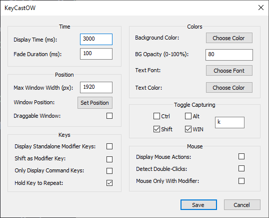

# KeyCastOW

Keystroke visualizer for Windows. This fork makes some changes inspired by [Screenkey](https://gitlab.com/screenkey/screenkey) for Linux. 

## Changes From Original

Keystrokes are now displayed using only a single display label, rather than certain keys/mouse actions creating new display labels. 
  - Keystrokes will always be appended to the current display label unless the keyboard combination to toggle capturing (default: <kbd>Win + Shift + K</kbd>) is pressed, in which case the label will be overwritten with a &#10006; or &#10004; to indicate the status of the program.

Pressing <kbd>Backspace</kbd> will now delete the last character in the display label if the last character is not a special character (e.g., <kbd>Tab</kbd>, <kbd>Enter</kbd>, <kbd>F1</kbd>) or key combination (e.g., <kbd>Ctrl + a</kbd>).
  - If the last character in the display label is a special character or key combination, the Unicode symbol for <kbd>Backspace</kbd> will be displayed instead of deleting the character.

<kbd>Backspace</kbd>, <kbd>Tab</kbd>, <kbd>Enter</kbd>, and <kbd>Space</kbd> have been replaced with their respective Unicode symbols.

Modified settings:
  - The display label now uses a single value for "linger time," rather than separate values for keystroke delay and linger time.
  - The maximum width of the display label is now configurable and will default to width of the user's display.
    - When using this setting, set your desired max width and then click the "Set Position" button to choose a location for the display label. Updating the label position with "Set Position" is currently required due to how the program updates the size of the display label.
  - Display time (previously "linger time") now has a maximum value of 60,000ms (60 seconds)
  - Fade duration now has a maximum value of 2,000ms (2 seconds)
  - Background opacity is now a percentage value rather than a 0-255 value

Removed settings:
  - Display border
  - Display corner rounding
  - Display alignment -- now defaults to right
  - Text opacity
  - Label preview
  - Maximum lines -- only one display label is used
  - Label spacing
  - Branding
  - Combination characters -- now hard-coded to `<+>` (e.g., `<Ctrl+a>`)

## Known Issues

- Dragging the display label using the "Draggable Window" option can cause the program to slow down (e.g., the display label will linger for longer than desired and will also take longer to fade out). This issue existed in the original software and was not introduced in this fork.

## Build

`msbuild /p:platform=win32 /p:Configuration=Release`

## License

MIT License
